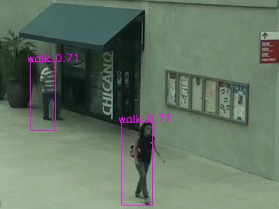

# Official PyTorch Implementation of SiA

Official PyTorch implementation of SiA, our model from **[Scaling Open-Vocabulary Action Detection](https://arxiv.org/abs/2504.03096)**. If you use this code for your research, please cite our paper.

## To-do
- [ ] Model Code
- [ ] Demo
- [ ] Eval
- [ ] HuggingFace

> **Scaling Open-Vocabulary Action Detection**<br>
> Z.H Sia and Y.S Rawat<br>
> <br>
> <p align="center">
>  
>  
>  
>  
> </p>
>
> **Abstract**: 

<p alighn="center">
In this work, we focus on scaling open-vocabulary action detection. Existing approaches for action detection are predominantly limited to closed-set scenarios and rely on complex, parameter-heavy architectures. Extending these models to the open-vocabulary setting poses two key challenges: (1) the lack of large-scale datasets with many action classes for robust training, and (2) parameter-heavy adaptations to a pretrained vision-language contrastive model to convert it for detection, risking overfitting the additional non-pretrained parameters to base action classes. Firstly, we introduce an encoder-only multimodal model for video action detection, reducing the reliance on parameter-heavy additions for video action detection. Secondly, we introduce a simple weakly supervised training strategy to exploit an existing closed-set action detection dataset for pretraining. Finally, we depart from the ill-posed base-to-novel benchmark used by prior works in open-vocabulary action detection and devise a new benchmark to evaluate on existing closed-set action detection datasets without ever using them for training, showing novel results to serve as baselines for future work.
</p>

## 0. Requirements
- We recommend you to use Anaconda to create a conda environment:
```Shell
conda create -n <yourenvname> python=3.10
```

- Then, activate the environment:
```Shell
conda activate <yourenvname>
```

- And install requirements:
```Shell
pip install -r requirements.txt 
```

## 1. Datasets and Annotations
- TBA

## 2. Evaluation
- TBA

## 3. Demo
- TBA

## Citation
```bibtex
@article{sia2025,
   author    = {Zhen Hao Sia and Yogesh Singh Rawat},
   title     = {Scaling Open-Vocabulary Action Detection},
   journal   = {arXiv preprint arXiv:2504.03096},
   year      = {2025},
}
```